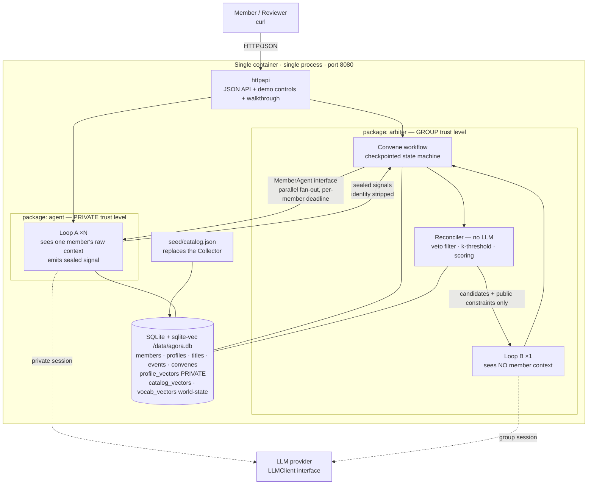
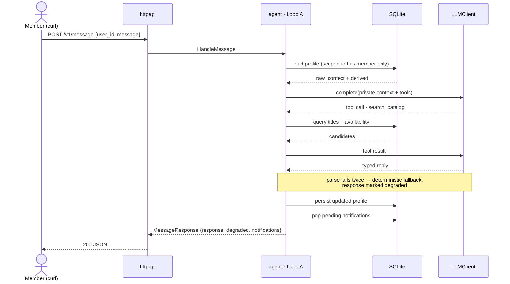
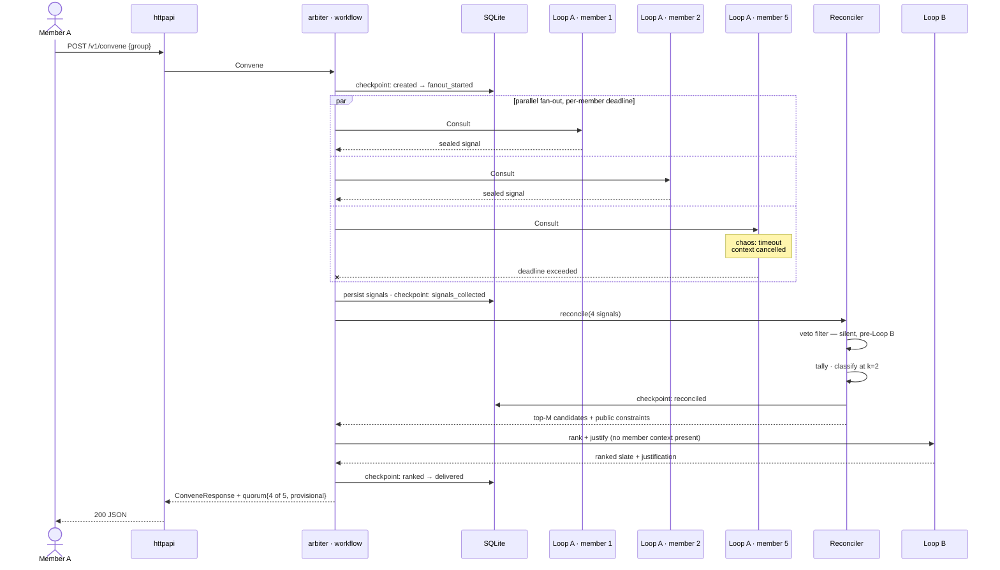

# TL;DR

This document rescopes `Design.md` to the constraints agreed in `Requirements_Rescoped.md`: one container, one process, no collector, no gRPC on the wire, one fixed family group.

It is written so that **every removal is a deferral, not a deletion.** Each element dropped from the prototype has a named production successor and a defined seam it slots back into. `Design.md` remains the record of the original, unconstrained design.

The substantive new content is the **two-loop model** in the LLM section. That is where isolation stops being a promise and becomes a property of the architecture.

---

# What changed, and what it becomes in production

| Element | `Design.md` (original) | Prototype (rescoped) | Path to production |
|---|---|---|---|
| Deployment | Kubernetes, managed EKS/GKE, kubectl | One container image, one process | K8s manifests + Helm/ArgoCD; the binary splits at existing interfaces |
| Services | 3 deployed services | 2 Go packages in 1 binary | Agent and Arbiter become separate deployments |
| Agent ↔ Arbiter | gRPC over the network | Go interface call, request/response shaped | Second implementation of the same interface, over gRPC |
| Protobuf | Generated, wired | `.proto` written as an artifact, **not** wired | Codegen and wire up; message shapes already match |
| Collector | Scrapes TMDB / JustWatch | Removed. Catalog is seeded JSON in the same normalized schema | Collector writes into the identical schema — additive, no consumer changes |
| Data normalization | LLM normalizes scraped data at collection time | Pre-normalized in the seed file | Restored with the collector |
| Client transport | REST, `curl` | HTTP/JSON, `curl` only — **no web UI** | Unchanged; Slack/web front ends reuse the endpoints |
| Store | SQLite + sqlite-vec | **Unchanged** — single SQLite file, sqlite-vec retained (see Storage) | Postgres + pgvector at catalog scale |
| Groups | Arbitrary groups, join semantics | One fixed family, seeded | Group CRUD and invitations |
| Notifications | Piggybacked on responses | Unchanged — piggybacked | NATS, delivered over the user's real channel |
| Async collection loop | Background scrape loop | Removed | Restored with the collector |
| Long-running workflow | Background timers | Durable state + simulated clock advanced by `tick` | Real timers, same state machine |

Nothing in the middle column forecloses anything in the right column. That is the design constraint this rescope was written under.

---

# Infrastructure Setup

## Deployment shape

A single container image. On start it runs **one process** that serves one port.

```
┌─ container ─────────────────────────────────────────────┐
│  agora (single Go binary)                               │
│                                                          │
│    :8080  ── JSON API     (POST /v1/*)                   │
│           ── demo controls(POST /v1/demo/*)              │
│           ── walkthrough  (POST /v1/demo/walkthrough)    │
│                                                          │
│    packages: agent, arbiter, store, llm                  │
│    volume:   /data/agora.db                              │
└──────────────────────────────────────────────────────────┘
```

**A note on "auto-start both processes".** Since agent and arbiter are packages inside one binary, there is nothing to supervise — no `supervisord`, no `s6`, no process manager in the image. They are two package trees in one process, concurrent via goroutines. This is strictly simpler than two processes and loses nothing: the boundary that matters is the **interface**, not the process. If we later want the split visible at runtime before the full gRPC move, the same binary can be started with a role flag (`--role=agent|arbiter|all`), which is a ten-line change. Recommended default for the prototype is `all`, one process.

## Component map

| Package | Responsibility | Knows about |
|---|---|---|
| `httpapi` | Routing, JSON marshalling, demo controls, walkthrough transcript | agent, arbiter |
| `agent` | Member sessions, **private context**, Loop A, sealed signal production | store, llm |
| `arbiter` | Convene workflow, checkpointing, reconciliation, k-threshold, Loop B | store, llm, `MemberAgent` interface |
| `store` | SQLite access, migrations, seed loading | — |
| `llm` | `LLMClient` and `Embedder` interfaces; live, deterministic and chaos implementations of each | — |

**The arbiter does not import the agent package.** It declares the interface it needs; `agent` satisfies it. Consumer-defined, per Go convention, and it is what makes the gRPC split mechanical rather than a refactor.

---

# Communication Flows

## Clients engage via curl (unchanged) or the browser

The interaction contract from `Design.md` is preserved verbatim:

```
curl -X POST https://agora.example.com/v1/message \
  -H "Content-Type: application/json" \
  -d '{
    "message": "I like watching christmas themed movies during the holiday season",
    "user_id": "user123",
    "session_id": "session123"
  }'
```

## Responses piggyback notifications (unchanged)

```json
{
  "response": "Noted — I'll keep an eye out for holiday titles as December gets closer.",
  "user_id": "user123",
  "degraded": false,
  "notifications": [
    {
      "type": "anniversary_rerelease",
      "message": "Some titles are re-releasing for their anniversary:",
      "data": { "movies": ["Interstellar", "Aliens", "Blade Runner"] }
    }
  ]
}
```

Two fields added for the reliability story: `degraded` (LLM fallback in use) and, on convene responses, `quorum: {"represented": 4, "of": 5, "provisional": true}`.

## Asynchronous data collection — removed

The background scrape loop is gone. The catalog arrives pre-normalized in `seed/catalog.json` and is loaded into SQLite at first start. The normalized schema is unchanged from `Design.md`, so the production collector writes into the same tables and no consumer changes.

## Agent ↔ Arbiter — internal method calls

No network hop, no serialization. The arbiter declares:

```go
// MemberAgent is what the arbiter needs from a member's agent.
// Implemented in-process today; over gRPC in production.
type MemberAgent interface {
    // Consult asks one member's agent for a sealed signal.
    // The returned signal carries no raw member context.
    Consult(ctx context.Context, req ConsultRequest) (ConsultResponse, error)
}
```

Request/response structs are one-to-one with the messages in `proto/agora.proto`, which is written but not compiled into the build. The `.proto` exists so the future split has a contract to generate from, and so reviewers can see the intended boundary.

---

# The Loop

This is the core of the prototype and the part most worth getting right.

## Why there are two loops, not one

The naive design is one LLM loop that receives every member's context and produces a group recommendation. That design cannot satisfy US4. Isolation would rest entirely on instructing the model not to repeat things it can see — which fails under prompt injection, fails under paraphrase, and fails silently.

So the loop is split by **trust level**, and isolation becomes a property of *what is in the context window* rather than of what the prompt asks for.

```
        ┌──────────── private trust level ────────────┐
        │  Loop A ×N, one per member, in parallel     │
        │  sees: ONE member's raw context             │
        │  emits: a sealed signal (no raw text)       │
        └──────────────────┬──────────────────────────┘
                           │  sealed signals, identity stripped
        ┌──────────────────▼──────────────────────────┐
        │  Reconciler (deterministic, no LLM)         │
        │  veto filter · k-threshold · scoring        │
        └──────────────────┬──────────────────────────┘
                           │  candidates + public constraints only
        ┌──────────────────▼──────────────────────────┐
        │  Loop B ×1, group trust level               │
        │  sees: NO member context, ever              │
        │  emits: ranked slate + justification        │
        └─────────────────────────────────────────────┘
```

**The load-bearing claim:** a member's raw context is never present in any context window that produces output shown to another member. Not filtered out — never present. A prompt-injection attempt by member B cannot extract member A's preferences from Loop B, because they were never there to extract.

## Loop A — the private member loop

Runs inside the agent package, once per member, in its own isolated LLM session.

- **Input:** that member's stored profile, their raw message (chat) or the convene request (fan-out), plus catalog tools.
- **Tools:** `get_my_profile`, `update_my_profile`, `search_catalog`, `get_availability`, `enqueue_notification`, `schedule_convene`.
- **Output, chat mode:** a natural-language reply to that member.
- **Output, convene mode:** a **sealed signal** — never free text.
- **Bounds:** max 4 tool iterations, per-loop deadline, typed parse of every model output.

## Loop B — the public group loop

Runs inside the arbiter, once per convene.

- **Input:** top-M candidate titles (already veto-filtered and scored) and the list of public constraints. Nothing else.
- **Tools:** `list_candidates`, `get_public_constraints`. That is the entire tool surface.
- **Output:** ranked slate with a justification.
- **Bounds:** max 3 tool iterations, deadline, typed parse.

**There is no tool in Loop B that can reach member context.** The tool surface *is* the isolation boundary, which is why it is enumerable and testable rather than a matter of prompt discipline.

## The sealed signal

```json
{
  "signal_id": "sig_7f3a",
  "constraints": [
    { "dim": "runtime_max_min", "value": 120,      "polarity": "prefer",  "weight": 0.8 },
    { "dim": "genre",           "value": "horror", "polarity": "exclude", "weight": 1.0 },
    { "dim": "era",             "value": "1990s",  "polarity": "prefer",  "weight": 0.4 }
  ],
  "vetoes": [ { "dim": "genre", "value": "horror" } ]
}
```

Three properties, each doing real work:

1. **Derived, never raw.** No user text survives into the signal. Loop A's job is to translate "I really can't do jump scares, gave me nightmares as a kid" into `{genre: horror, exclude}`. The anecdote stays behind.
2. **Closed vocabulary.** `dim` and `value` come from a fixed enumeration. This is what makes the k-threshold *decidable* — you cannot reliably count that "wants something short" and "prefers brief films" are the same constraint if they are free text. Anonymity requires countability.
3. **No identity.** The signal carries no `member_id` by the time it reaches the reconciler. The fan-out layer holds the mapping separately, and only for quorum accounting.

## Anonymity is three layers, not one step

A natural reading of the pipeline is *"Loop A returns responses, the arbiter anonymizes them, Loop B consumes them."* That is close, but it compresses three separate mechanisms into one and misplaces where `k` acts. Two clarifications first:

- The fan-out returns **N** responses — one per member whose agent answered. N is the quorum count.
- **`k` is a threshold on constraint counts, not on responses.** N and `k` are unrelated numbers that happen to both be small. A convene with N=4 responders might have constraints with counts of 3, 2, 1 and 1.

Anonymization is not a step between the loops. It is three layers, each defeating a different attack:

| Layer | Where it acts | Attack it defeats | Conditional? |
|---|---|---|---|
| **1. Content de-identification** | Loop A, at signal emission — enums only, no free text ever enters the signal | Verbatim leak, and paraphrase leak | Unconditional |
| **2. Identity stripping** | The fan-out boundary. The workflow retains the member↔signal map for quorum accounting; the reconciler receives an unordered bag | Direct attribution — "signal 3 belongs to Priya" | Unconditional |
| **3. `k`-threshold** | The reconciler, applied to the tally | **Inference from rarity** — "only one person could want that" | Uses `k` |

Layer 3 is the subtle one and the reason `k` exists at all. Layers 1 and 2 defeat *reading* another member's context; neither prevents *deducing* it. If the justification says "we included a Korean horror title for the group," member B — who knows their own preferences and can reason about the others — infers Priya immediately. The name was already stripped. Rarity did the identifying.

## Reconciliation, and the k-threshold

Deterministic. No LLM. This matters: the privacy-critical step is the one step that is not a model call, so its behavior is testable and its output is stable.

1. **Veto filter.** Remove every title matching any veto from the candidate set. Silent — see below.
2. **Tally.** Group remaining constraints by `(dim, value)` across all signals, summing weights and counting distinct contributing signals.
3. **Classify.** `count >= k` → **public constraint**, eligible to appear in the justification. `count < k` → **private constraint**, affects scoring only, never named.
4. **Score.** Rank the candidate set using *all* constraints, public and private alike. Take the top M.
5. **Hand to Loop B** the top M candidates and the public constraints only.

`k = 2` for a family of ~5. A useful safety property falls out for free: **k is absolute, not relative to responders.** If only one member's agent responds, no constraint can reach k, so the justification is entirely generic — which is exactly right, because with one responder any named constraint is attributable to them.

`k` is also the **domain-translation knob**. `k = 1` reproduces the source cloud domain, where attribution is acceptable and every constraint is speakable; `k = 2` is the family setting; `k = n` is total anonymity. The prototype implements a superset of the source domain's requirements and ports back by changing one value.

### Worked example — 5 members, 4 responded

| Constraint | Signals holding it | Class | Effect |
|---|---|---|---|
| `runtime_max_min: 120` | 3 | **public** (≥ k) | ranks **and** speakable |
| `genre: comedy, prefer` | 2 | **public** (≥ k) | ranks **and** speakable |
| `era: 1990s, prefer` | 1 | private | ranks only — never spoken |
| `language: korean, prefer` | 1 | private | ranks only — never spoken |
| `genre: horror` — **veto** | 1 | veto | candidates removed *before* Loop B |

Loop B receives the veto-filtered candidate list, already scored using **all five** constraints, plus a public-constraint list containing only *short* and *comedy*. It can rank with the full signal and speak about only two of it. The Korean-horror inference is unavailable to any member, because the phrase never enters Loop B's context.

## Veto handling — the sharp case

A veto is by definition held by one member, so `count = 1`, so it is below threshold and can never be spoken. But it must be honored absolutely: "I can't watch horror" is not a preference to be outvoted.

Honoring it visibly would re-identify the member instantly. The resolution is that **vetoes are applied as a hard filter before Loop B ever sees the candidate set.** The model cannot explain the absence of horror films because it was never shown any. Enforcement is total and explanation is impossible, which is the correct combination.

This is the clearest illustration of the whole design: the strongest privacy guarantee in the system comes not from instructing the model, but from what we decline to put in front of it.

## Degradation matrix

| Failure | Detection | Behavior | Reviewer sees |
|---|---|---|---|
| Member agent times out | `context` deadline on that goroutine | Signal absent. Convene proceeds at reduced quorum | `quorum: {represented: 4, of: 5, provisional: true}` |
| Member agent errors | Error return from `Consult` | Same as timeout | Same |
| LLM fails in Loop A | Provider error, or parse failure after one retry | **Tier 2** — embed the phrase, nearest-neighbour against `vocab_vectors`. Lower fidelity, valid signal | `degraded: true, tier: 2` |
| LLM **and** embeddings fail in Loop A | Both providers error | **Tier 3** — keyword match over the vocabulary | `degraded: true, tier: 3` |
| `sqlite-vec` fails to load at startup | Extension load error | Log, disable tier 2, boot on tiers 1 and 3. Semantic catalog search falls back to attribute matching | Startup log; `tier: 2` never offered |
| LLM fails in Loop B | Provider error, or parse failure after one retry | Skip the model. Return deterministically scored top-N with a templated justification built from public constraints | `degraded: true`, templated wording |
| All member agents fail | Zero signals | Return the catalog's general top titles, clearly labeled as unpersonalized | `quorum: {represented: 0, of: 5}`, `degraded: true` |
| Model returns unparseable output | Typed unmarshal fails | Retry once, then fall back. **Never** pass unparsed model text into a justification | `degraded: true` |

That last row is a privacy control, not just a robustness one: raw model text is the likeliest accidental leak path, so it is never allowed through un-typed.

## Descope seam — cutting anonymity cleanly

Anonymity is the most likely thing to be dropped if the build runs long, so the cut must be a **configuration change, not a code excision**. The three-layer split makes this possible, because the layers do not sit on top of each other — they are independent, and only the third is anonymity.

**The cut line runs between layers 2 and 3.** Layers 1 and 2 are *isolation*, which is inherited from the source domain and is the thesis. They are never cut. Layer 3 is *anonymity*, which is net-new, and is cut by setting `k = 1`.

### One policy object, consulted only by the reconciler

```go
// arbiter/anonymity.go — the entire anonymity surface
type AnonymityPolicy struct {
    K                  int  // 1 = anonymity off (cloud parity); 2 = family default
    GateJustifications bool // enforce that no below-threshold constraint is spoken
    RevealVetoes       bool // false = silent pre-filter; true = surfaced as a group constraint
}

func CloudParity() AnonymityPolicy { return AnonymityPolicy{K: 1, GateJustifications: false, RevealVetoes: true} }
func FamilyDefault() AnonymityPolicy { return AnonymityPolicy{K: 2, GateJustifications: true, RevealVetoes: false} }
```

**No package outside `arbiter/anonymity.go` may reference `k` or the public/private classification.** That is the invariant that keeps the cut a one-line change. The reconciler asks the policy how to classify; nothing else knows the concept exists.

### What moves and what does not

| Concern | Location | Cut when anonymity is descoped? |
|---|---|---|
| Sealed signal is enums only, no free text | `agent/signal.go` | **No** — isolation |
| Identity stripped at the fan-out boundary | `arbiter/workflow.go` | **No** — isolation |
| Scoped store accessor for `raw_context`, `profile_vectors` | `store/scoped.go` | **No** — isolation |
| `k`-threshold classification | `arbiter/anonymity.go` | **Yes** — `K = 1` |
| Justification gate | `arbiter/anonymity.go` | **Yes** — `GateJustifications = false` |
| Silence of the veto filter | `arbiter/anonymity.go` | **Yes** — `RevealVetoes = true`. The filter itself stays; it is a correctness feature, only its silence is an anonymity feature |

At `k = 1` every constraint becomes speakable, so justifications get richer — but member names still never appear, because layer 2 stripped identity before the reconciler ever saw the signals. Descoping anonymity therefore degrades to **exactly the cloud-domain behavior**, which is the correct floor.

### The API shape must not change on descope

`ConveneResponse` carries one field, `constraints`, whose contents the policy decides. It is not renamed `public_constraints` under one policy and `constraints` under the other. Otherwise cutting anonymity becomes a client-visible change and stops being a one-line cut.

### The tests must split along the same line

This is the part that is easy to get wrong. The two US4 build gates go in **separate files**, because one survives the cut and one does not:

| Gate | File | Behavior when `K = 1` |
|---|---|---|
| No member's raw preference string appears in any response to another member | `test/isolation_gate_test.go` | **Still runs.** Always. |
| No justification contains a below-threshold constraint or a member name | `test/anonymity_gate_test.go` | **Skipped**, guarded on `policy.GateJustifications` |

If both assertions live in one test, descoping anonymity breaks the isolation gate too, and the cut is no longer clean. Separate files, separate guards.

### Descope ladder, in cut order

If time runs short, cut in this order — each seam is already in the design:

1. **Anonymity** → `CloudParity()` policy. Isolation, reliability and the workflow all survive intact.
2. **Loop B** → skip the model, return deterministically scored top-N with a templated justification. This path already exists as the LLM-outage fallback, so cutting it means shipping the fallback as the only path.
3. **Scheduled convenes (US6)** → keep on-demand convene, drop `tick` and the simulated clock.

Cutting from the bottom of that list first would be a mistake: US6 is cheap and demonstrates durability, while anonymity is the most expensive claim to defend and the only one that is optional.

## Continuity with the tools named in ClaudeDirections.md

| Original tool | Rescoped |
|---|---|
| `update_user_context` | Loop A tool `update_my_profile` |
| `get_recommendations_from_context` | Loop A: `search_catalog` + scoring |
| `get_matching_events_in_group` | **Promoted from a tool to the convene workflow** — it needs fan-out, deadlines, quorum and checkpointing, none of which a single tool call can express |
| `send_notification` | Loop A tool `enqueue_notification`; delivery piggybacks the next response |
| `set_asynchronous_task` | Loop A tool `schedule_convene`; advanced by the simulated clock |

---

# Convene Workflow — durability

State machine, checkpointed to SQLite before every external call:

```
created ──▶ fanout_started ──▶ signals_collected ──▶ reconciled ──▶ ranked ──▶ delivered
```

- Each transition is persisted before the call that causes the next one, so a crash resumes rather than restarts.
- Collected signals are persisted, so a restart mid-convene does not re-consult members who already answered.
- A convene stuck in `fanout_started` past its deadline is swept forward to `signals_collected` with whatever arrived.
- `scheduled` convenes hold a `fire_at` against the **simulated clock**; `POST /v1/demo/tick` advances it and drives any due workflow to completion.

---

# Data Model

Five tables. One SQLite file.

| Table | Key columns | Notes |
|---|---|---|
| `members` | `member_id` PK, `display_name`, `group_id` | Seeded. One group in the prototype |
| `profiles` | `member_id` PK/FK, `raw_context` JSON, `derived` JSON, `updated_at` | **`raw_context` is only ever read by that member's own Loop A** |
| `titles` | `title_id` PK, genre, era, runtime, availability JSON | Loaded from `seed/catalog.json` |
| `events` | `event_id` PK, `title_id` FK, `window_start`, `window_end` | Against the simulated clock |
| `convenes` | `convene_id` PK, `group_id`, `state`, `fire_at`, `signals` JSON, `result` JSON | The workflow checkpoint record |
| `profile_vectors` | vec0 virtual table, `member_id` | **Private trust level.** Scoped accessor only |
| `catalog_vectors` | vec0 virtual table, `title_id` | World-state. Title + synopsis embeddings |
| `vocab_vectors` | vec0 virtual table, `dim`, `value` | World-state. Canonical constraint vocabulary, embedded once at seed |

The original design's separate session table is folded into `profiles` — with one group and a stable `member_id`, a distinct session entity earns nothing in the prototype. Sessions return in production alongside authentication.

`raw_context` and `profile_vectors` never leave their rows except into that member's own Loop A. This is enforced at the store layer with a scoped accessor, not by convention, so a future careless caller cannot reach either one. The two world-state vector tables have no such restriction.

---

# Storage

Single file-backed store, as in `Design.md`: `/data/agora.db`, holding both relational and context data. **`sqlite-vec` is retained.**

## What the vectors are for

Embeddings earn their place in two specific jobs, and are deliberately excluded from a third.

**Job 1 — the middle rung of the degradation ladder.** Loop A must translate free text ("I really can't do jump scares") into a closed-vocabulary constraint (`{genre: horror, exclude}`). The LLM does this best. Without vectors, the only fallback is keyword matching, which is a cliff. With them there are three tiers:

| Tier | Mechanism | Available when |
|---|---|---|
| 1 | LLM extraction — handles negation, idiom, nuance | Normal operation |
| 2 | Embed the phrase, nearest-neighbour against the embedded canonical vocabulary | Completion endpoint down, embedding endpoint up |
| 3 | Keyword / substring match over the vocabulary | Both down |

Completion and embedding endpoints fail independently, so tier 2 is a real operating mode rather than a theoretical one. `LLMClient` and `Embedder` are therefore **separate interfaces**, failable separately and injected separately by the chaos decorator.

**Job 2 — semantic catalog search inside Loop A.** "Something cozy and autumnal" matches no genre enum but does match title and synopsis embeddings. This is the RAG pattern from `Design.md`, retained, and it lives entirely at private trust level so it raises no isolation question.

**Job 3 — reconciliation. Deliberately excluded.** Reconciliation stays deterministic and vector-free, for the reasons that made it non-LLM in the first place: the k-threshold needs *countable, equal* constraints, and nearest-neighbour similarity does not tell you "these two members want the same thing" with the crispness anonymity accounting requires. Vectors get free text to the vocabulary; from there on, everything is enums.

## Vectors split by trust level

**A vector is not anonymized merely because it is not text.** A profile embedding is derived, but it is re-identifying and partially invertible, so it obeys exactly the same boundary as `raw_context`.

| Vector table | Trust level | Reachable from |
|---|---|---|
| `profile_vectors` | **Private** — scoped to one member | That member's own Loop A only, via the scoped store accessor |
| `catalog_vectors` | World-state | Anywhere, including Loop B |
| `vocab_vectors` | World-state (canonical constraint terms) | Anywhere |

**Sealed signals never carry embeddings.** They remain closed-vocabulary enums. Shipping a profile vector across the boundary would both re-identify the member and collapse the countability argument the k-threshold rests on. This is the single most important rule in the storage design.

## Build handling

`sqlite-vec` is a loadable extension, so the packaging risk is real and is mitigated rather than ignored:

- CGO with `mattn/go-sqlite3`, extension loaded at open; multi-stage Docker build where the build stage and runtime stage share a base image, so the linked libc matches.
- `Embedder` has a deterministic no-op implementation (stable hash to a fixed-dimension vector) used in unit tests, which keeps tests hermetic and gives tier 3 its floor.
- Vector search is behind the `Embedder` interface, so if extension loading fails at startup the binary logs it, disables tier 2, and continues on tiers 1 and 3 rather than refusing to boot. Startup degradation is itself part of the reliability story.

At catalog scale this becomes Postgres + pgvector; the interfaces do not change.

---

# API Design

Request/response semantics throughout, shaped so each internal method maps one-to-one onto a future gRPC method.

## External — HTTP/JSON

| Method | Path | Purpose |
|---|---|---|
| `GET` | `/` | Plain-text usage: the copy-pasteable `curl` blocks. No HTML |
| `POST` | `/v1/message` | Chat turn (US1, US2) |
| `GET` | `/v1/members` | Seeded roster, so a reviewer knows which `user_id`s exist |
| `POST` | `/v1/convene` | Request a group movie night (US3) |
| `POST` | `/v1/demo/reset` | Restore seed state |
| `POST` | `/v1/demo/tick` | Advance the simulated clock (US6) |
| `POST` | `/v1/demo/chaos` | Inject member timeout or LLM outage (US5) |
| `POST` | `/v1/demo/walkthrough` | Run the full scenario server-side, return a narrated transcript |

## The walkthrough endpoint

There is no web UI. The one thing a page would have provided that `curl` does not is the **comparative view** — the same convene seen by different members, side by side, which is where the isolation claim becomes visceral. Five terminal invocations and a mental diff is a worse version of that.

`POST /v1/demo/walkthrough` recovers it for almost nothing. It runs the scripted scenario internally and returns a transcript:

```json
{
  "steps": [
    {
      "n": 4,
      "actor": "member_b",
      "action": "asks the agent what member_a wants",
      "request":  { "user_id": "member_b", "message": "What does Priya like?" },
      "response": { "response": "I can only speak to your own preferences..." },
      "demonstrates": "US4 isolation — no raw context crosses to another member",
      "passed": true
    }
  ],
  "summary": { "criteria_met": 5, "of": 5 }
}
```

**It shares its implementation with the Tier 6 demo smoke test.** The test calls the orchestration and asserts on each step; the endpoint calls the same orchestration and returns the transcript. One body of code, no new technology, no additional test surface — and a reviewer sees all six user stories, including the comparative isolation view, in a single request.

## Internal — Go interfaces, gRPC-shaped

```go
// arbiter, called by httpapi — mirrors ProcessClientRequest
type Arbiter interface {
    HandleMessage(ctx context.Context, req MessageRequest) (MessageResponse, error)
    Convene(ctx context.Context, req ConveneRequest) (ConveneResponse, error)
}

// what the arbiter needs from a member's agent — mirrors ConsultMember
type MemberAgent interface {
    Consult(ctx context.Context, req ConsultRequest) (ConsultResponse, error)
}

// swappable providers, per ClaudeDirections — mirrors ProcessLLMRequest
type LLMClient interface {
    Complete(ctx context.Context, req LLMRequest) (LLMResponse, error)
}

// Separate from LLMClient so the two fail independently — this is what
// makes tier 2 of the degradation ladder a real operating mode.
type Embedder interface {
    Embed(ctx context.Context, texts []string) ([][]float32, error)
}
```

`LLMClient` and `Embedder` each ship three implementations: the live provider, a deterministic one used by the degradation path and by tests, and a chaos decorator injecting latency and errors. The chaos decorator also wraps `MemberAgent`, which is how `POST /v1/demo/chaos` works without any conditionals inside the workflow — and because the two interfaces are separate, chaos can fail completions while leaving embeddings healthy, which is precisely the tier-2 demonstration.

Every method keeps the discipline from `Design.md`: distinct request/response types, a validation layer that fails fast, and well-defined error types.

---

# Diagrams

## System architecture



## Query–response use case



## Convene workflow use case, with a failing member



---

# Production Design

Unchanged in intent from `Design.md`, now with concrete seams.

- **Split the binary.** `agent` and `arbiter` become separate deployments. `MemberAgent` gains a gRPC implementation generated from the already-written `proto/agora.proto`. No call-site changes.
- **A real client surface.** Slack bot and web front end, both over the existing REST endpoints. The prototype's omission of a UI is a scoping decision, not an architectural one — nothing needs to change to add one.
- **Restore the Collector.** Writes into the existing normalized `titles` / `events` schema. No consumer changes.
- **Interfaces.** Slack bot and web front end reuse the existing HTTP endpoints.
- **Notifications.** NATS replaces response piggybacking; the `notifications` field stays for clients that prefer polling.
- **Storage.** Postgres + pgvector, or restored sqlite-vec, once the catalog is large enough for semantic retrieval to beat attribute matching.
- **Kubernetes.** Manifests and Helm/ArgoCD, per the original design.
- **Authentication.** JWT-based auth on the REST surface, mTLS between services. A solved problem, documented rather than built — per `ClaudeDirections.md`.
- **Groups.** Group CRUD, invitations, multi-group membership. Note that `k` should scale with group size in production; a fixed `k=2` is a small-group choice.
- **Real timers.** The simulated clock is replaced; the workflow state machine is unchanged.

---

# Decisions taken

1. **Process model — one process.** No supervisor in the image. The packages share a binary and the interface is the real boundary; a `--role` flag can make the split visible later in about ten lines.
2. **`sqlite-vec` — retained.** It buys the middle rung of the degradation ladder and semantic catalog search in Loop A, and is excluded from reconciliation, which stays deterministic and enum-only. Profile vectors sit at private trust level; sealed signals never carry embeddings.
3. **Vetoes — silent hard filter.** Applied before Loop B sees the candidate set. Honored absolutely, never explainable, never re-identifying.
