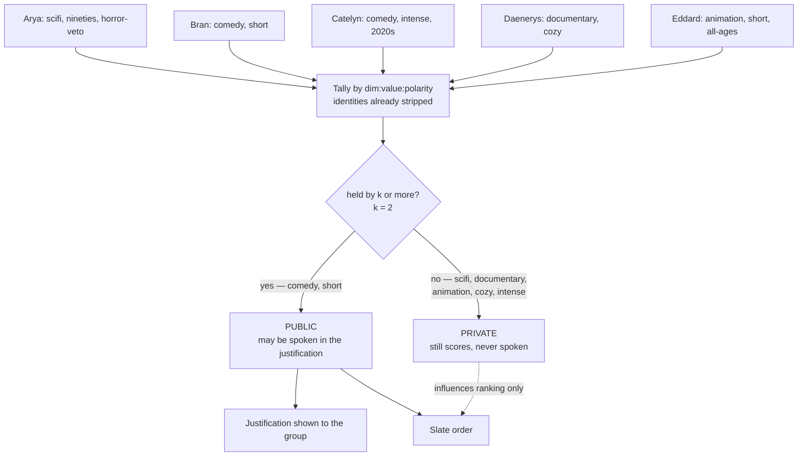
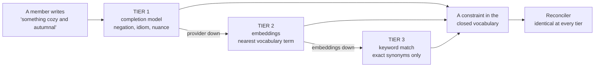
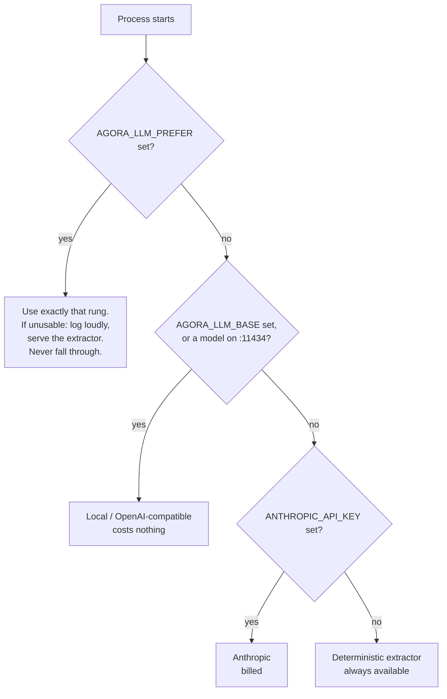

# Mechanisms

The four mechanisms the system runs on, in detail. The [README](../README.md)
carries the argument — two loops split by trust level, and why one process
still isolates. This document carries the machinery underneath it.

Written by Claude.

---

## Anonymity is three layers, not one step

| Layer | Where | Defeats | Conditional? |
|---|---|---|---|
| 1. Content de-identification | Loop A, at emission | verbatim & paraphrase leak | unconditional |
| 2. Identity stripping | fan-out boundary | direct attribution | unconditional |
| 3. `k`-threshold | reconciler | **inference from rarity** | uses `k` |

Layer 3 is the subtle one. Stripping a name does not stop a member reasoning *"the slate mentions Korean horror, I didn't ask for it, and I know the others — that's Arya."* Rarity does the identifying.

**`k` is the domain-translation knob**, not a magic number: `k=1` reproduces the cloud case, `k=2` is the family, `k=n` is total anonymity. `AGORA_K=1 make test` runs the whole suite at `k=1`, and `AGORA_K=1 make pipeline` does it through the deployed container, so the anonymity descope seam is verified continuously.




Both arrows into the slate matter. A private constraint changes *what is
recommended* without changing *what is said* — suppressing a minority
preference from the explanation does not suppress it from the outcome.

## Vetoes

A veto is held by one member, so it is permanently below threshold and can never be spoken — yet must be honoured absolutely. Vetoed titles are removed **before Loop B is given the candidate set**: enforcement total, explanation impossible. The strongest guarantee in the system comes from what we decline to put in front of the model.

## Degradation is a ladder, not a switch

| Tier | Mechanism | Available when |
|---|---|---|
| 1 | LLM extraction — negation, idiom, nuance | normal |
| 2 | embed the phrase, nearest-neighbour against the vocabulary | completions down, embeddings up |
| 3 | keyword match over the vocabulary | both down |

`LLMClient` and `Embedder` are separate interfaces because the endpoints fail independently. If `sqlite-vec` fails to load at startup the process boots anyway, logs it, and simply never offers tier 2.




Each rung loses fidelity, never correctness. The reconciler downstream cannot
tell which tier produced a constraint, which is why the privacy properties hold
identically on all three.

## Providers — two implementations, one chain

Selection is a chain, and every outcome is logged and served on `/healthz`, so
"is this actually talking to a model?" is answerable from outside the process.

| Rung | Condition | Provider |
|---|---|---|
| 1 | `AGORA_LLM_BASE` set, or a local model answering on `:11434` | that OpenAI-compatible endpoint |
| 2 | `ANTHROPIC_API_KEY` set | Anthropic Messages API |
| 3 | neither | deterministic extractor, stated loudly |

One image then behaves correctly in both places it runs, with no per-environment
configuration: a developer box ships neither a model nor a key and lands on the
simulated path, spending nothing; the deployed host has a key and no local
model, so it lands on Anthropic without being told to.

`AGORA_LLM_PREFER` pins a rung — `ollama`, `anthropic`, or `simulated`. **A
pinned provider that cannot be used does not walk down the chain.** It logs
loudly and serves the extractor, because falling from "I demanded Ollama" to "I
quietly billed you for Anthropic" is the failure this exists to prevent.

The local `make` targets hand the container **neither a model nor a key**, so
the default costs nothing and needs nothing — and that holds even if your shell
exports `ANTHROPIC_API_KEY`.

```bash
make pipeline                             # simulated: free, fast, the default
make pipeline AGORA_LLM_PREFER=ollama     # a real local model (run make ollama-setup first)
make pipeline AGORA_LLM_PREFER=anthropic  # the paid path, for a pre-deploy check
```

`pipeline` asserts the container is running the provider *and* the anonymity
policy it was asked for, both via `/healthz`. For a local model it also runs
`curl` from *inside* the container against the host, because `/healthz` reports
what was configured and that is necessary but not sufficient — Ollama binds
`127.0.0.1` by default, which no container can route to.

```bash
make ollama-setup                         # installs, pulls a small model, serves it
make pipeline AGORA_LLM_PREFER=ollama

# any OpenAI-compatible provider (Groq, OpenRouter, Together, OpenAI)
AGORA_LLM_BASE=https://api.groq.com/openai/v1 AGORA_LLM_KEY=gsk_... make run
```




A developer box ships neither a model nor a key and lands on the extractor; the
deployed host has a key and no local model and lands on Anthropic. Same image,
no per-environment configuration.

One `Compat` implementation covers Ollama, Groq, OpenRouter, Together and
OpenAI because they share the `/v1/chat/completions` shape. It reuses the same
prompts as the Anthropic client — the Loop B prompt carries the isolation
instructions, and a second copy would be a second place for those to drift.
The model name is optional: with none configured the client asks the provider
what it has, because local model names are user-chosen and guessing is never
right.
